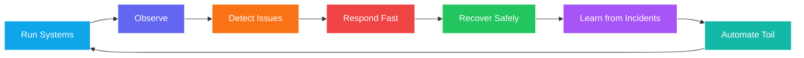

<!--
  Aesthetic GitHub Profile README for @Sheeshgit

  Notes:
  - GitHub blocks custom JavaScript/CSS in README files, so the animations below use safe SVG/image generators.
  - Keep this file as README.md inside a public repository named exactly: Sheeshgit
  - If any repo names change, update the project links in the Project Showcase section.
-->

<div align="center">

  
  <a href="https://git.io/typing-svg">
    
  </a>

  
  
  
  
  

  <br />
  <a href="https://www.linkedin.com/in/ashish-john-jeyaraj-439475101/">
    
  </a>
  <a href="mailto:ashish.jeyaraj40@gmail.com">
    
  </a>
  <a href="https://github.com/Sheeshgit">
    
  </a>

</div>

---

<div align="center">

### ⚡ Engineering Mantra

> **Make lovable systems which last.**

</div>

---

## 👋 About Me

```yaml
name: Ashish John Jeyaraj
base: Bengaluru, India
role: Software Development Engineer 2
focus:
  - DevOps and SRE practices
  - Production support and incident analysis
  - Observability, logs, dashboards, and automation
  - Cloud-native engineering and CI/CD workflows
currently_learning:
  - Kubernetes
  - GitOps
  - Cloud networking and IAM
  - AI-assisted engineering workflows
mission: "Reduce noise, automate toil, and help teams recover faster."
```

I build, monitor, troubleshoot, and automate systems that need to stay reliable.

- 🔧 I work across **DevOps, production support, SRE practices, and process automation**.
- 📊 I enjoy turning messy logs, incidents, and dashboards into clear engineering decisions.
- 🚀 I like building practical tools that help teams **detect faster, recover better, and document learnings clearly**.
- 🧠 I am currently strengthening my skills in **cloud-native systems, CI/CD, Kubernetes, observability, and agentic engineering**.

---

## 🧭 My SRE Operating Loop



---

## 🧰 Tech Toolbox

<div align="center">


<br /><br />


</div>

---

## 🚀 Project Showcase

<table>
  <tr>
    <td width="33%" valign="top">
      <div align="center">
        <h3>🤖 AI Log Analyzer</h3>
        
        <br /><br />
        <a href="https://github.com/Sheeshgit/ai-log-analyzer">
          
        </a>
      </div>
      <br />
      <p>
        A Python-based tool that parses logs, extracts error patterns, identifies correlation IDs,
        and creates structured troubleshooting summaries.
      </p>
      <p>
        <strong>Focus:</strong> Logs, automation, RCA, incident analysis
      </p>
    </td>
    <td width="33%" valign="top">
      <div align="center">
        <h3>☁️ Cloud CI/CD Pipeline</h3>
        
        <br /><br />
        <a href="https://github.com/Sheeshgit/cloud-cicd-pipeline">
          
        </a>
      </div>
      <br />
      <p>
        A deployment pipeline that builds, tests, scans, and deploys a containerized application
        using GitHub Actions and cloud services.
      </p>
      <p>
        <strong>Focus:</strong> Docker, CI/CD, GitHub Actions, cloud
      </p>
    </td>
    <td width="33%" valign="top">
      <div align="center">
        <h3>📊 SRE Dashboard</h3>
        
        <br /><br />
        <a href="https://github.com/Sheeshgit/sre-dashboard">
          
        </a>
      </div>
      <br />
      <p>
        A reliability dashboard concept for monitoring service health, error rates,
        incident trends, and recovery indicators.
      </p>
      <p>
        <strong>Focus:</strong> Grafana, metrics, SLOs, reliability
      </p>
    </td>
  </tr>
</table>

---

## 🧠 What I Like Building

| Area | What I Build / Improve | Why It Matters |
|---|---|---|
| **Reliability Engineering** | Monitoring, alerting, incident response, post-incident learning | Systems become easier to operate under pressure |
| **Automation** | Scripts, workflows, and repeatable runbooks | Reduces manual mistakes and repetitive toil |
| **Cloud & DevOps** | CI/CD pipelines, containers, infrastructure workflows | Faster and safer software delivery |
| **Observability** | Dashboards, log analysis, metrics, traces | Teams see what is happening before customers do |
| **Documentation** | PMR notes, RCA summaries, handovers, playbooks | Knowledge becomes reusable and scalable |

---

## 🧩 Reliability Principles I Care About

<table>
  <tr>
    <td>✅ <strong>Automate toil</strong></td>
    <td>Remove repetitive manual work wherever possible.</td>
  </tr>
  <tr>
    <td>✅ <strong>Make failure visible</strong></td>
    <td>Logs, metrics, traces, and alerts should tell a clear story.</td>
  </tr>
  <tr>
    <td>✅ <strong>Recover safely</strong></td>
    <td>Good systems need practical rollback, backup, and DR thinking.</td>
  </tr>
  <tr>
    <td>✅ <strong>Document what matters</strong></td>
    <td>Runbooks and RCA notes should help the next engineer move faster.</td>
  </tr>
  <tr>
    <td>✅ <strong>Improve after incidents</strong></td>
    <td>Every incident should produce one useful learning or improvement.</td>
  </tr>
</table>

---

## 📈 GitHub Cockpit

<div align="center">


<br /><br />


<br /><br />


<br /><br />


</div>

<!--
Optional extra animation:
To show a contribution snake animation, add a GitHub Action that generates:
https://raw.githubusercontent.com/Sheeshgit/Sheeshgit/output/github-contribution-grid-snake-dark.svg

Then uncomment this:

<div align="center">
  
</div>
-->

---

## 🌱 Currently Leveling Up

<div align="center">


</div>

---

## 🤝 Let's Connect

<div align="center">

<p>
  <strong>Open to learning, collaborating, and building reliable engineering systems.</strong>
</p>

<a href="https://www.linkedin.com/in/ashish-john-jeyaraj-439475101/">
  
</a>
<a href="mailto:ashish.jeyaraj40@gmail.com">
  
</a>
<a href="https://github.com/Sheeshgit">
  
</a>

<br /><br />


</div>
